<div align="center">

  
  <h1>Final Year Project</h1>
  
  <h3>
    MOCR (Multilingual Optical Character Recognition)
  </h3>
  <h5>
    The project supports English and Devanagari characters. 
  </h5>
  
  
<!-- Badges -->
<p>
<!--   <a href="https://github.com/AnisH1427/Multilingual-OCR-FYP/contributors"> -->
<!--      -->
<!--   </a> -->
  <a href="">
    
  </a>
  <a href="https://github.com/AnisH1427/Multilingual-OCR-FYP/network/members">
    
  </a>
  <a href="https://github.com/AnisH1427/Multilingual-OCR-FYP/stargazers">
    
  </a>
  <a href="https://github.com/AnisH1427/Multilingual-OCR-FYP/issues/">
    
  </a>
  <a href="https://github.com/AnisH1427/Multilingual-OCR-FYP/blob/master/LICENSE">
    
  </a>
</p>
   
<h4>
    <a href="https://github.com/AnisH1427/Multilingual-OCR-FYP/">View Demo</a>
  <span> · </span>
    <a href="https://github.com/AnisH1427/Multilingual-OCR-FYP">Documentation</a>
  <span> · </span>
    <a href="https://github.com/AnisH1427/Multilingual-OCR-FYP/issues/">Report Bug</a>
  <span> · </span>
    <a href="https://github.com/AnisH1427/Multilingual-OCR-FYP/issues/">Request Feature</a>
  </h4>
</div>

<br />

<!-- Table of Contents -->
# :notebook_with_decorative_cover: Table of Contents

- [About the Project](#star2-about-the-project)
  * [Datasets] (#datasets)
  * [Screenshots](#camera-screenshots)
  * [Tech Stack](#space_invader-tech-stack)
  * [Features](#dart-features)
  * [Color Reference](#art-color-reference)
  * [Environment Variables](#key-environment-variables)
- [Getting Started](#toolbox-getting-started)
  * [Prerequisites](#bangbang-prerequisites)
  * [Installation](#gear-installation)
  * [Running Tests](#test_tube-running-tests)
  * [Run Locally](#running-run-locally)
  * [Deployment](#triangular_flag_on_post-deployment)
- [Usage](#eyes-usage)
- [Roadmap](#compass-roadmap)
- [Contributing](#wave-contributing)
  * [Code of Conduct](#scroll-code-of-conduct)
- [FAQ](#grey_question-faq)
- [License](#warning-license)
- [Contact](#handshake-contact)
- [Acknowledgements](#gem-acknowledgements)

  

<!-- About the Project -->
## :star2: About the Project
I have used this project using CRNN+Ctc loss. The OCR project has two languages: English and Devanagari. It uses Chain approximation and Otsu method for edge detection, and makes predictions based on the detected edges.

### :datasets: About the datasets
For the English language model, I used the IAM English handwritten dataset. This is a widely recognized dataset for training and evaluating handwritten text recognition systems. To train the Devanagari model, I manually collected and labeled a dataset of Bhagwat Gita scriptures. Bhagwat Gita is a sacred Hindu text written in the Devanagari, Hindi with some sort of sanskrit script, providing a challenging and domain-specific dataset for the Devanagari OCR task.

<!-- Screenshots -->
### :camera: Screenshots

<div align="center"> 
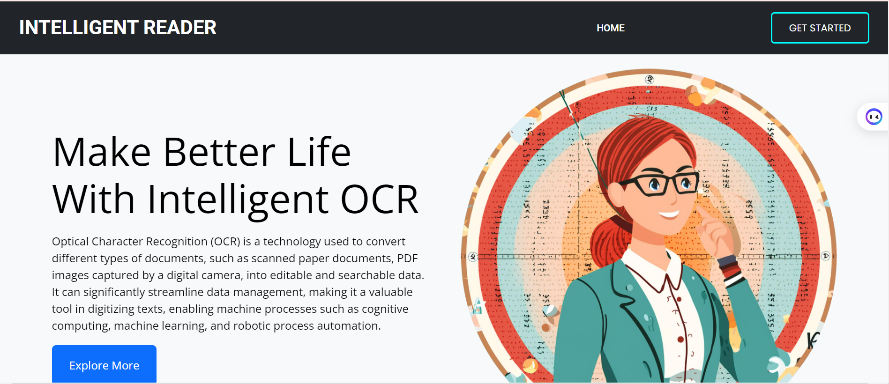

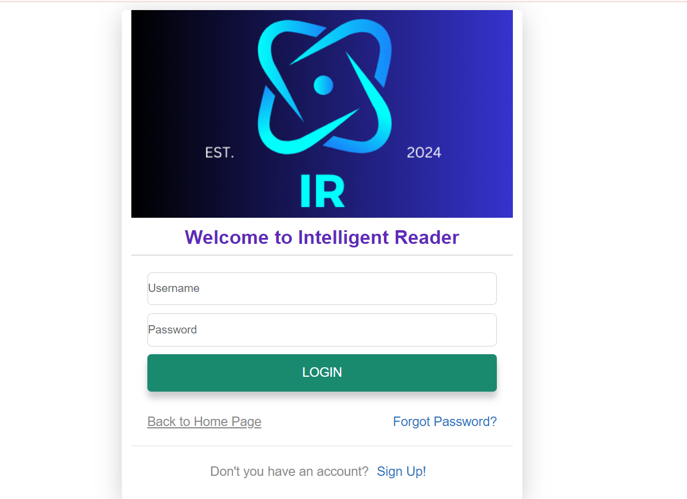
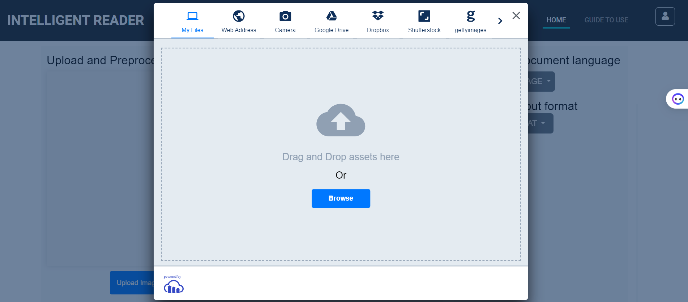
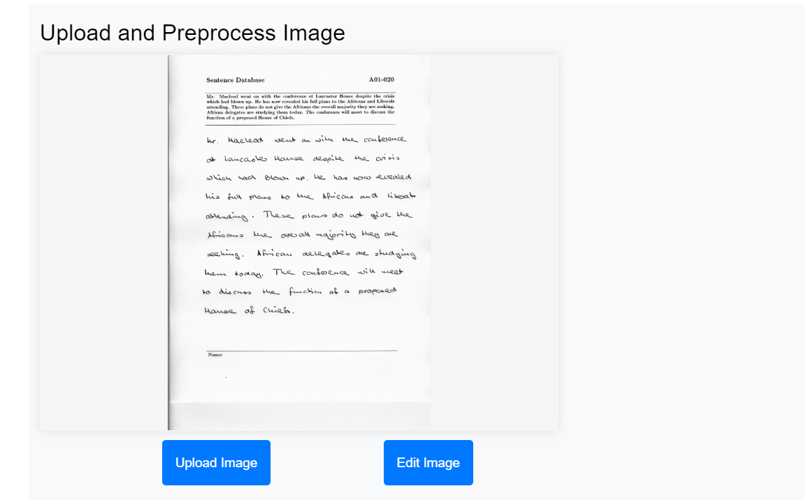
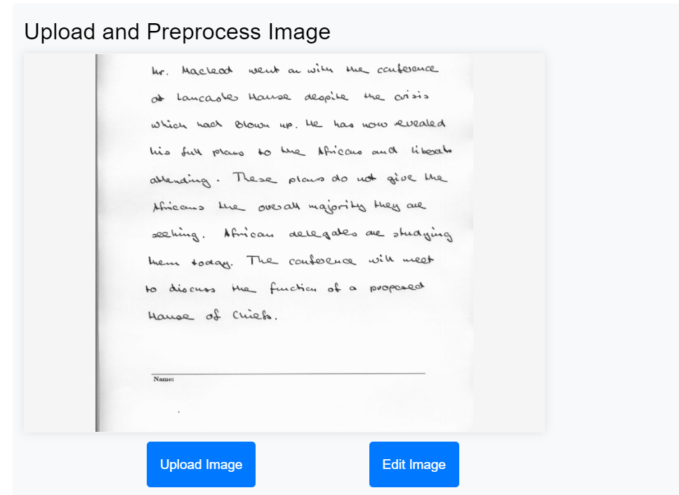
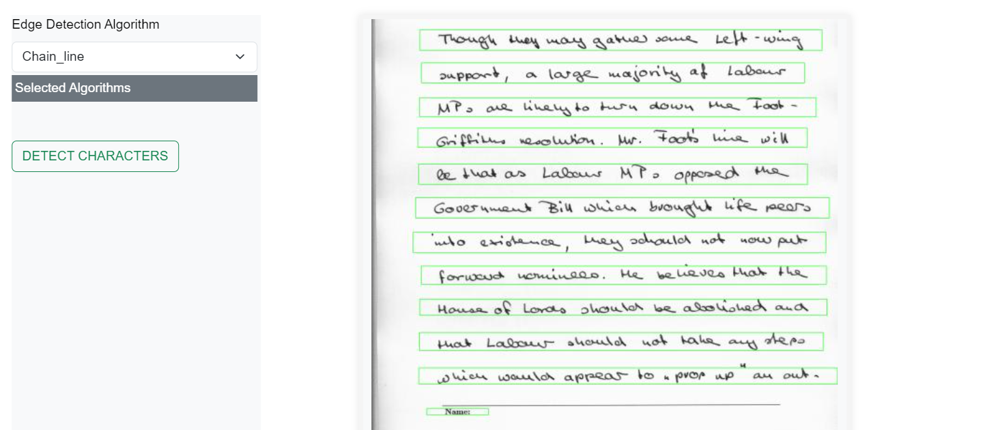
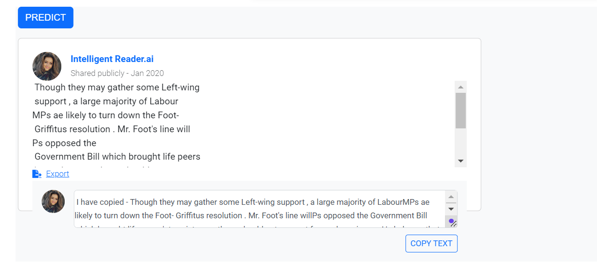
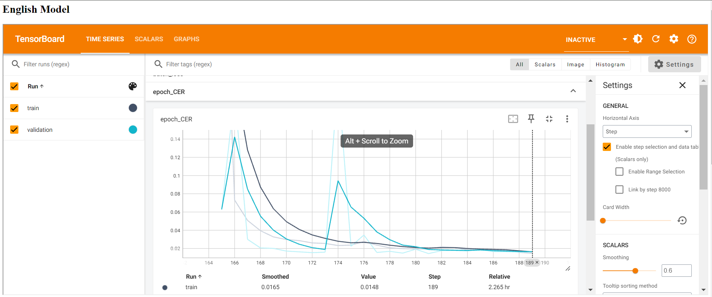
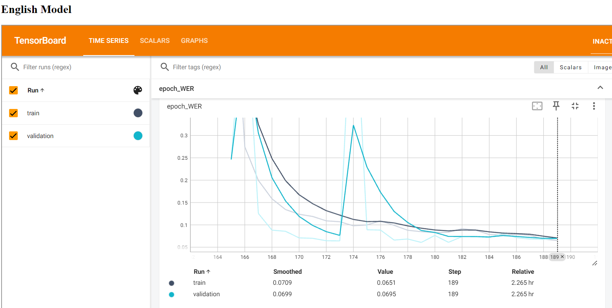
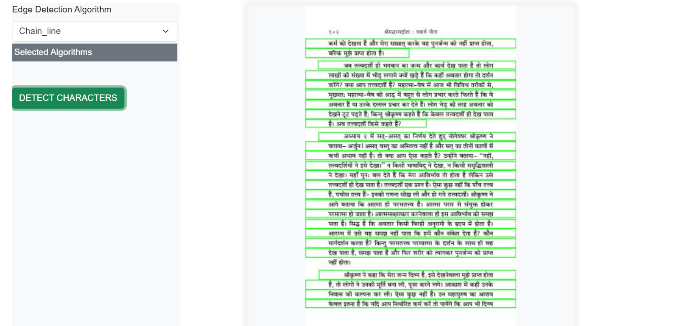
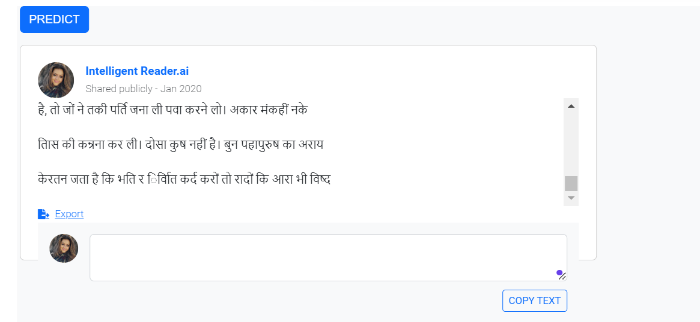
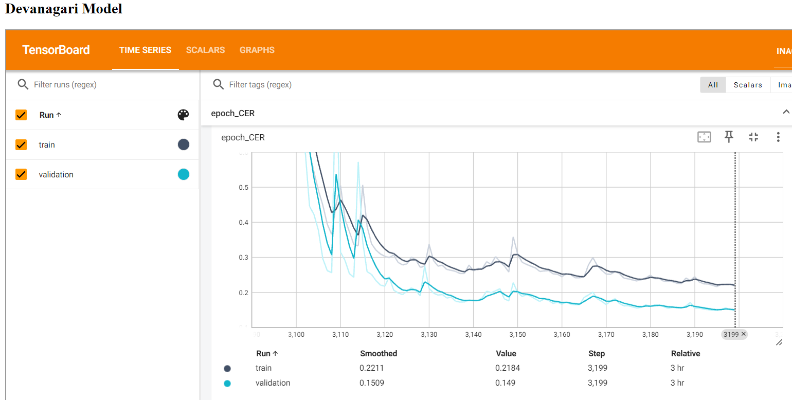
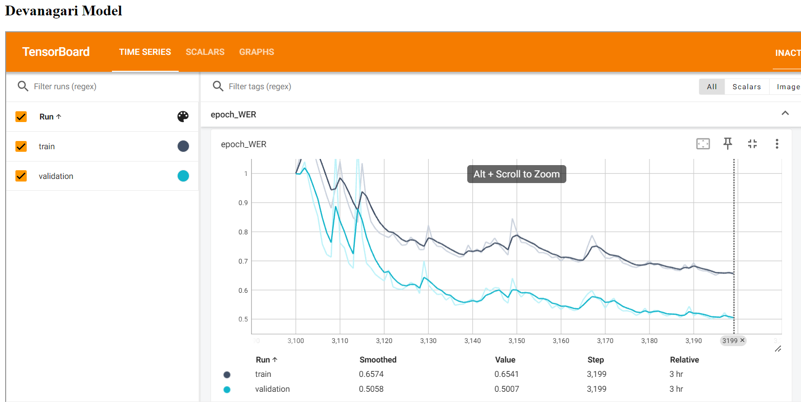

  <!-- <!--  -->
</div>


<!-- TechStack -->
### :space_invader: Tech Stack

<details>
  <summary>Modeling stacks</summary>
  <ul>
    <li><a href="https://www.typescriptlang.org/">MLTU</a></li>
    <li><a href="https://expressjs.com/">Tensorflow</a></li>
    <li><a href="https://go.dev/">Keras</a></li>
    <li><a href="https://go.dev/">OpenCV</a></li>
    <li><a href="https://go.dev/">Tensorboard</a></li>
  </ul>
</details>


<details>
  <summary>Server</summary>
  <ul>
    <li><a href="https://www.typescriptlang.org/">Python</a></li>
    <li><a href="https://expressjs.com/">Django Rest Framework</a></li>
    <li><a href="https://go.dev/">Cloudinery</a></li>
 
  </ul>
</details>

<details>
<summary>Database</summary>
  <ul>
    <li><a href="https://www.sqlite.org/">SQLite</a></li>
  </ul>
</details>

<details>
  <summary>Client</summary>
  <ul>
    <li><a href="https://www.typescriptlang.org/">Vannila Javascript</a></li>
    <li><a href="https://nextjs.org/">Html</a></li>
    <li><a href="https://reactjs.org/">CSS</a></li>
    <li><a href="https://tailwindcss.com/">Bootstrap</a></li>
  </ul>
</details>

<details>
<summary>DevOps</summary>
  <ul>
    <li><a href="https://www.docker.com/">Docker</a></li>
  </ul>
</details>

<!-- Features -->
### :dart: Features

- OCR model develop from ownselves instead of using Others
- Detect, Extract textual content from Image and export in desired format
- Supports Two language script, English and Devanagari

<!-- Color Reference -->
### :art: Color Reference

| Color             | Hex                                                                |
| ----------------- | ------------------------------------------------------------------ |
| Primary Color |  #222831 |
| Secondary Color |  #393E46 |
| Accent Color |  #00ADB5 |
| Text Color |  #EEEEEE |


<!-- Env Variables -->
### :key: Environment Variables

To run this project, you will need to add the following environment variables to your .env file

` Cloudinery API_KEY for storing Uploaded image`

`Your email host password for recovering forgot password`

<!-- Getting Started -->
## :toolbox: Getting Started

<!-- Prerequisites -->
### :bangbang: Prerequisites

This project uses Docker for containerization. Make sure you have Docker installed on your machine. If not, you can download it from [here](https://www.docker.com/products/docker-desktop).

<!-- Run Locally -->
### :running: Run Locally

Clone the project

```bash
  git clone https://github.com/AnisH1427/Multilingual-OCR-FYP.git
```

Go to the project directory

```bash
  cd Multilingual-OCR-FYP
```

Install pipenv if you haven't already

```bash
  pip install pipenv
```

Install dependencies

```bash
  pipenv install
```

Activate the pipenv shell

```bash
  pipenv shell
```

Start the server

```bash
  python manage.py runserver
```

<!-- Dockerization -->
### :whale: Dockerization

Build the Docker image

```bash
docker build -t your-image-name .
```

Check the Docker images

```bash
docker images
```

Run the Docker container

```bash
docker run -d -p 8080:80 your-image-name
```

<!-- Deployment -->
### :triangular_flag_on_post: Deployment

To deploy this project, you can use the Docker container you built in the previous step.

<!-- Running Tests -->
### :test_tube: Running Tests

To run tests, use the following command

```bash
  python manage.py test
```

<!-- Roadmap -->
## :compass: Roadmap

* [x] Data Acquisition
* [x] Research
* [x] Design Architecture
* [x] Test with Different Hyperparameters
* [x] Keep Training and Improving
* [x] Design REST API
* [x] Design User Interface
* [x] Backend Setup
* [x] Deploy Model
* [x] Performance Monitoring Using Tensorboard


<!-- Contributing -->
## :wave: Contributing

<!-- <a href="https://github.com/AnisH1427/Multilingual-OCR-FYP/graphs/contributors"> -->
  <!--  -->
</a>

This project is Solely Contributed by MySelf as Final Year Project

<!-- Code of Conduct -->
### :scroll: Code of Conduct

Please read the [Code of Conduct](https://github.com/AnisH1427/Multilingual-OCR-FYP/blob/master/CODE_OF_CONDUCT.md)

<!-- FAQ -->
## :grey_question: Academic Questions and Answers

- What are the limitation in Current OCR so that Intelligent OCR is still the topic of research?

  + Answer 1

- Why OCR sysytem dont have different level of Performance in different languages?

  + Answer 2

- What can be done to improve the existing OCR systems?

  + Answer 3


<!-- License -->
## :warning: License

Distributed under MIT license


<!-- Contact -->
## :handshake: Contact

Your Name - [@linkedin](https://www.linkedin.com/in/anish-khatiwada-42a719229/) - anishkhatioda@outlook.com, anishkhatioda@gmail.com

Project Link: (https://github.com/AnisH1427/Multilingual-OCR-FYP)


<!-- Acknowledgments -->
## :gem: Acknowledgements

Use this section to mention useful resources and libraries that you have used in your projects.

 - [Biru Shrestha] - Project Supervisor 
 - [Uttam Acharya] - Reader

